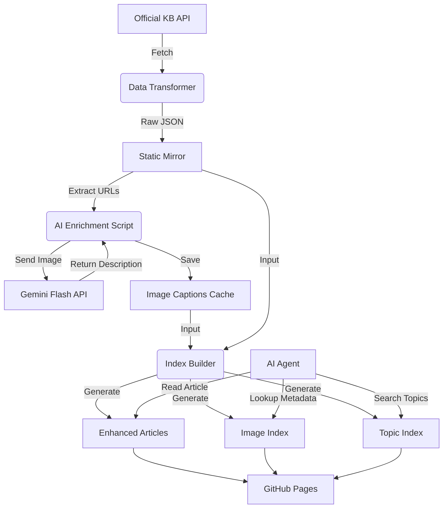

# Technical Research Study: AI-Enhanced Knowledge Base with Visual Search

## Executive Summary

This project demonstrates a novel architecture for transforming a standard Help Center Knowledge Base (KB) into an AI-ready, visually searchable data source. By enriching standard article data with AI-generated image descriptions and creating specialized indexes, we enable Large Language Model (LLM) agents to "see" and "search" the visual content of documentation—capabilities traditionally absent from text-only RAG (Retrieval-Augmented Generation) systems.

The result is a static, serverless API hosted on GitHub Pages that provides:
1.  **Enhanced Articles:** Standard JSON articles enriched with detailed, AI-generated descriptions of every screenshot.
2.  **Visual Search Index:** A reverse index allowing agents to find images based on semantic topics (e.g., "Find images of the 'Webhook' menu").
3.  **Zero-Infrastructure Deployment:** The entire system runs as static files, requiring no database or backend server.

---

## 1. The Problem: "Blind" AI Agents

Traditional RAG systems ingest text but ignore visual data. When a user asks, *"Where is the 'Save' button?"* or *"What does the dashboard look like?"*, a standard text-based agent fails because:
*   **Screenshots are opaque:** The agent sees `` but has no idea what is inside the image.
*   **Context is lost:** Visual cues (colors, layout, icons) are critical for UI navigation but are missing from the text.
*   **Search is text-only:** Agents can search for the word "dashboard" but cannot find an *image* of the dashboard.

## 2. The Solution: AI Enrichment & Indexing Pipeline

Our solution implements a multi-stage pipeline to unlock this visual data.

### Phase 1: Data Ingestion & Transformation
We start by mirroring the official KnowBe4 Help Center API.
*   **Source:** Official Zendesk-based API (`support.knowbe4.com`).
*   **Process:** A Python script (`data_transformer.py`) iterates through all articles, sections, and categories.
*   **Transformation:**
    *   Downloads raw JSON data.
    *   Rewrites internal links to point to our local static mirror.
    *   Sanitizes HTML content for better compatibility.
    *   **Result:** A complete, static mirror of the KB in JSON format.

### Phase 2: AI Image Enrichment
This is the core innovation. We use Google's Gemini Flash model to "watch" the documentation.
*   **Extraction:** The system identifies every image URL within the article body.
*   **Vision Processing:** Each image is sent to the Gemini API with a specific prompt: *"Describe this UI element in detail. Mention buttons, colors, text, and layout."*
*   **Caching:** The generated descriptions are stored in a local cache (`image_captions.json`) to prevent redundant API calls and costs.
*   **Output:** A rich textual description for every single image (e.g., *"A green 'Create' button located in the top-right corner of the Webhooks panel"*).

### Phase 3: Experimental Index Generation
We build specialized indexes to make this new data accessible to agents.
*   **Script:** `build_experimental_indexes.py`
*   **Enhanced Articles:** We generate new JSON files where the `images` array is populated with the AI descriptions.
    ```json
    "images": [
      {
        "url": "...",
        "alt": "Screenshot of the Webhooks menu...",
        "context": "Click the + Create button."
      }
    ]
    ```
*   **Topic Extraction:** We analyze the article titles and section names to generate high-value "topics" (e.g., "Webhooks", "Console", "Security"). *Note: We intentionally exclude the verbose image descriptions from topic generation to keep the index clean.*
*   **Visual Search Index (`topics_to_images.json`):** A reverse lookup map.
    *   **Key:** Topic (e.g., "webhooks")
    *   **Value:** List of Image IDs that relate to that topic.

---

## 3. Architecture & Data Flow



## 4. Key Components

### 4.1. The Visual Index (`topics_to_images.html`)
This file acts as the "search engine" for images.
*   **Function:** Allows an agent to find images without knowing which article they are in.
*   **Example:**
    *   **Query:** "console"
    *   **Result:** `["10103021848723_1", "10495383627155_2", ...]`

### 4.2. The Master Image List (`image_index.html`)
This file acts as the "database" for image metadata.
*   **Function:** Provides the full details for any Image ID found in the search index.
*   **Content:**
    *   `description`: The full AI-generated text.
    *   `article_title`: Where the image comes from.
    *   `article_url`: A direct link to the parent article.
    *   `context`: The text immediately surrounding the image in the article.

### 4.3. Enhanced Article Format
Standard Help Center articles are flat text. Our enhanced articles are structured data objects.
*   **Standard:** `<body>...  ...</body>`
*   **Enhanced:**
    ```json
    {
      "title": "...",
      "body": "...",
      "images": [
        {
          "url": "foo.png",
          "description": "A configuration panel showing...",
          "position": 1
        }
      ]
    }
    ```

## 5. Usage Scenarios

### Scenario A: "How do I add a webhook?"
1.  **Agent Action:** Searches `articles.html` for "webhook".
2.  **Result:** Finds article `10103021848723`.
3.  **Retrieval:** Reads the enhanced JSON.
4.  **Value Add:** The agent can now describe the UI: *"Go to the Account Integrations menu. You will see a green '+ Create' button in the top right corner."* (Information that was only available in the screenshot).

### Scenario B: "Show me what the console looks like."
1.  **Agent Action:** Searches `topics_to_images.html` for "console".
2.  **Result:** Gets a list of Image IDs.
3.  **Lookup:** Checks `image_index.html` for the descriptions.
4.  **Value Add:** The agent can describe different views of the console from multiple articles, synthesizing a comprehensive visual answer without needing to read every single article first.

## 6. Conclusion

This project successfully bridges the gap between text-based documentation and visual understanding. By pre-processing visual data and structuring it into semantic indexes, we empower simple LLM agents to perform complex, multi-modal tasks using nothing more than static JSON files hosted on GitHub Pages. This architecture is scalable, cost-effective, and significantly improves the user support experience.
